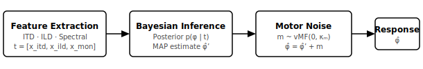

.. _background:

.. meta::
   :keywords: Bayesian, sound localization, HRTF, von Mises, likelihood, MLE,
              auditory model, model-based analysis, computational modelling,
              evaluating HRTF, individual acoustics, Bayes inference,
              spatial hearing, head-related transfer function,
              sagittal-plane localisation, monaural cues, ITD, ILD,
              motor noise, prior, BIC, identifiability, psychoacoustics

Model and Statistical Framework
=================================

This page is for readers who want to understand the statistical machinery
behind :mod:`bayesian_listener`.  Equation numbers refer to :footcite:t:`barumerli2023` and
:footcite:t:`barumerli2026`; the two papers use consistent notation.

Model pipeline
--------------

The model simulates a single static-sound-localisation trial in three stages:

1. **Feature extraction.**  The binaural stimulus generated by a source at
   direction :math:`\boldsymbol{\varphi}` is characterised by a vector of
   noisy spatial features (Eq. 1 of :footcite:t:`barumerli2023`):

   .. math::

      \mathbf{t} = [x_\mathrm{itd},\, x_\mathrm{ild},\, \mathbf{x}_{L,\mathrm{mon}},\,
                    \mathbf{x}_{R,\mathrm{mon}}] + \boldsymbol{\delta}

   where :math:`x_\mathrm{itd}` is the interaural time difference (ITD),
   :math:`x_\mathrm{ild}` the interaural level difference (ILD), and
   :math:`\mathbf{x}_{L/R,\mathrm{mon}}` the monaural log-amplitude spectra
   for the left and right ears.  The additive noise :math:`\boldsymbol{\delta}
   \sim \mathcal{N}(\mathbf{0}, \boldsymbol{\Sigma})` represents perceptual
   uncertainty, with diagonal covariance (Eq. 2 of :footcite:t:`barumerli2023`):

   .. math::

      \boldsymbol{\Sigma} =
      \begin{pmatrix}
        \sigma_\mathrm{itd}^2 & 0 & 0 \\
        0 & \sigma_\mathrm{ild}^2 & 0 \\
        0 & 0 & \sigma_\mathrm{mon}^2 \mathbf{I}
      \end{pmatrix}

2. **Bayesian inference.**  The listener's internal estimate of the source
   direction is the maximum a-posteriori (MAP) direction
   :math:`\hat{\varphi}'` obtained by combining the sensory likelihood with
   an elevation prior (Eqs. 4–6 of :footcite:t:`barumerli2023`):

   .. math::

      p(\mathbf{t} \mid \boldsymbol{\varphi}) =
        \mathcal{N}(\mathbf{t} \mid \mathbf{s}(\boldsymbol{\varphi}),\,
                    \boldsymbol{\Sigma})

   .. math::

      p(\boldsymbol{\varphi}) \propto \exp\!\left(
        -\frac{\epsilon^2}{2\,\sigma_\mathrm{prior}^2}\right)

   .. math::

      \hat{\varphi}' = \arg\max_{\boldsymbol{\varphi}}\;
        p(\mathbf{t} \mid \mathbf{s}(\boldsymbol{\varphi}))\,
        p(\boldsymbol{\varphi})

   where :math:`\epsilon` is the elevation angle of :math:`\boldsymbol{\varphi}`
   and :math:`\mathbf{s}(\boldsymbol{\varphi})` is the noiseless template at
   that direction, interpolated from the listener's HRTF.

3. **Motor noise.**  The final pointing response :math:`\hat{\varphi}` is
   the MAP estimate perturbed by direction-independent motor noise
   (Eq. 7 of :footcite:t:`barumerli2023`):

   .. math::

      \hat{\varphi} = \hat{\varphi}' + \mathbf{m}, \quad
      \mathbf{m} \sim \mathrm{vMF}(\mathbf{0},\, \kappa_m)

   where :math:`\kappa_m` is the von Mises–Fisher concentration parameter,
   related to the motor-noise standard deviation :math:`\sigma_m` in degrees
   via :math:`R = I_1(\kappa_m)/I_0(\kappa_m) = \exp(-\sigma_m^2/2)`.

.. _background_likelihood:

Likelihood function
-------------------

For a localisation experiment with :math:`R` trials, the model likelihood is
(Eq. 8 of :footcite:t:`barumerli2026`):

.. math::

   \mathcal{L}(\boldsymbol{\theta} \mid
     [\hat{\varphi}_1^*, \ldots, \hat{\varphi}_R^*],\,
     [\boldsymbol{\varphi}_1, \ldots, \boldsymbol{\varphi}_R])
   = \prod_{i=1}^{R}\, p(\hat{\varphi}_i^* \mid \boldsymbol{\varphi}_i,\,
     \boldsymbol{\theta})

where :math:`\boldsymbol{\theta} = \{\sigma_\mathrm{itd}, \sigma_\mathrm{ild},
\sigma_\mathrm{mon}, \sigma_\mathrm{prior}, \kappa_m\}`.

Because the integral over internal estimates has no closed form (Eq. 9 of
:footcite:t:`barumerli2026`), it is approximated via Monte Carlo with :math:`M` samples
(Eq. 10 of :footcite:t:`barumerli2026`):

.. math::

   p(\hat{\varphi}^* \mid \boldsymbol{\varphi},\, \boldsymbol{\theta})
   \approx \frac{1}{M} \sum_{m=1}^{M}
     \mathrm{vMF}(\hat{\varphi}^* \mid \hat{\varphi}_m,\, \kappa_m)

:math:`M = 200` samples is sufficient for stable likelihood approximation
(see Fig. S2 of :footcite:t:`barumerli2026`).

Model comparison uses the Bayesian Information Criterion (Eq. 14 of
:footcite:t:`barumerli2026`):

.. math::

   \mathrm{BIC} = k \ln(R) - 2\ln\mathcal{L}(\hat{\boldsymbol{\theta}})

where :math:`k` is the number of free parameters.

.. _background_datasets:

Datasets
--------

The package has been validated on the
`SONICOM Multi-Experiment Auditory Localisation Dataset
<https://ecosystem.sonicom.eu/databases/58>`_.
It contains localisation trials from 34 participants tested across
seven HRTF conditions (individual measured, synthetic individual, best-match,
worst-match, KEMAR, and random non-individual HRTFs) collected at the Turret
Lab, Imperial College London. Responses are provided as CSV with per-trial
azimuth, elevation, and great-circle error in both spherical and
horizontal-polar coordinates.
The validation and fitting of the model has been done on the
individual measured condition.

.. _background_parameters:

Noise parameters
----------------

The model has five noise parameters.  Two are fixed at literature values;
three are estimated by the two-stage fitting procedure.

.. list-table::
   :widths: 12 28 20 18 22
   :header-rows: 1

   * - Symbol
     - Physical interpretation
     - Typical range
     - Identifiability
     - Fixed or fitted
   * - :math:`\sigma_\mathrm{itd}`
     - ITD perceptual noise (dimensionless)
     - — (fixed)
     - —
     - **Fixed** at 0.569
   * - :math:`\sigma_\mathrm{ild}`
     - ILD perceptual noise (dB)
     - — (fixed)
     - —
     - **Fixed** at 1.0 dB
   * - :math:`\sigma_m`
     - Motor noise standard deviation (degrees)
     - 2°–36° (median ≈ 10°)
     - Good (:math:`r = 0.97`)
     - **Fitted** (stage 1, lateral only)
   * - :math:`\sigma_\mathrm{mon}`
     - Monaural spectral noise (dB)
     - 2–15 dB
     - Moderate (:math:`r = 0.85`)
     - **Fitted** (stage 2, full sphere)
   * - :math:`\sigma_\mathrm{prior}`
     - Elevation prior width (degrees)
     - 5°–90°
     - Poor–Moderate (:math:`r = 0.84`, positive bias)
     - **Fitted** (stage 2, full sphere)

Identifiability ratings and ranges are from the parameter recovery analysis
in :footcite:t:`barumerli2026`.

.. _background_interpolation:

Template interpolation
----------------------

The template :math:`\mathbf{s}(\boldsymbol{\varphi})` is computed by
interpolating listener-measured HRTF features onto a quasi-uniform spherical
grid of :math:`T = 2{,}112` directions (4° average spacing).  Four methods
are available:

- **SHMAX** (recommended): regularised spherical-harmonic (SH) interpolation
  with order selected per dataset to maximise numerical stability.
- **SH**: SH interpolation with a fixed order; can undersmooth high-frequency
  spectral detail.
- **barycentric**: barycentric interpolation on the Delaunay triangulation of
  the sampling grid; computationally lighter than SH.
- **barumerli2023**: the original MATLAB implementation; retains features only
  above the minimum measurement elevation and is included for backward
  compatibility.

Full-sphere spatial coverage and high-frequency spectral fidelity are the
primary determinants of template quality; among full-sphere methods the choice
of algorithm is secondary for dense measurement grids such as SONICOM
(:footcite:t:`barumerli2026`, Sec. 3.2).

.. _background_limitations:

Known limitations
-----------------

The following limitations affect the interpretation of fitted parameters and
model predictions.

**Lateral accuracy bias.**
  The model cannot reproduce a non-zero mean lateral error by construction
  (the response noise is zero-mean).  Observed lateral biases likely reflect
  pointing-apparatus calibration or individual motor asymmetries not captured
  by the current formulation.

**Poor identifiability of** :math:`\sigma_\mathrm{prior}` **at large values.**
  When :math:`\sigma_\mathrm{prior}` exceeds roughly 70°, the prior becomes
  approximately uniform over elevation and its contribution to the posterior
  is indistinguishable from a flat prior.  Recovered values show a systematic
  positive bias at large ground-truth values (mean bias +19.9°, :footcite:t:`barumerli2026`).

**Motor noise degrades for near-chance polar responders.**
  :math:`\sigma_m` is estimated from lateral responses; participants with
  near-chance polar performance carry little information about
  :math:`\sigma_\mathrm{mon}`, resulting in noisier spectral-noise estimates.

**Variable trial counts across participants.**
  The behavioural dataset pools three experiments with different repetitions
  per direction (3, 6, or 9).  Raw likelihood comparisons across participants
  should account for trial count via BIC.

**Extrapolation below the measurement boundary (barumerli2023 only).**
  The ``barumerli2023`` method assigns zero template mass below the lowest
  measured HRTF elevation, biasing the posterior for sources near or below
  the horizontal plane.  Full-sphere methods avoid this by extrapolating
  features into the lower hemisphere.

Further reading
---------------

The standard localisation metrics implemented in
:mod:`bayesian_listener.metrics` follow the definitions of
:footcite:t:`middlebrooks1999`.  The gammatone filterbank used in
:func:`~bayesian_listener.utils.compute_features` follows the ERB-rate
scale of :footcite:t:`glasberg1990`.  The barycentric (VBAP) interpolation in
:func:`~bayesian_listener.utils.vbap_interpolate` follows
:footcite:t:`pulkki1997`, and parameter optimisation throughout
:mod:`bayesian_listener.fitting` is performed with BADS :footcite:t:`acerbi2017`.

.. rubric:: References

.. footbibliography::
